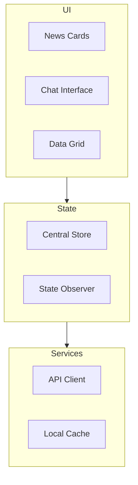

# Technical Architecture

## System Overview

The News Aggregator implements a modern web architecture with clear separation of concerns and emphasis on maintainability and scalability.

## Core Components

### Frontend Architecture

## Card Creation & Chat Integration
- Card creation is now managed through the state module, guaranteeing unique card IDs
- User queries always create cards, even for edge-case search terms like "cats"
- The `handleAskGrok()` function in app.js processes user queries and ensures proper card creation
- Debug logging is available throughout the application when debug mode is enabled

### Card Management Commands
The chat interface now supports natural language commands for managing cards:

1. **Delete Commands**
   - "delete the new card"
   - "remove this card"
   - "delete the latest card"

2. **View Controls**
   - "minimize this card" - Collapses to header only
   - "expand the card" - Shows full content
   - "make this card compact/normal/expanded" - Adjusts card size

Commands always target the most recently created card by default. A help tooltip is available in the chat interface showing all available commands.

## State Management
- Centralized in `state.js` with clearly defined functions for state manipulation
- Observer pattern implementation with subscribers notified of state changes
- State includes: search results (cards), chat history, user info, loading/error states
- All state mutations go through dedicated functions like `addSearchResult()`, `addChatMessage()`, etc.

## API Integration
- `api.js` handles all external API communication
- Implements client-side caching for faster response and reduced API calls
- Standardized error handling and response formatting
- Auth token management for secured API endpoints

## Tabulator Integration
- Tables are rendered through the UI module with consistent formatting
- Date formatting is handled by the `formatDateSafe()` utility, with fallbacks
- Support for both card view (multiple tables) and paginated table view
- Improved pagination controls with proper spacing and visibility

## Server-side Optimizations
- Caching layer for news API responses to reduce external API calls
- Pagination support for large datasets with proper parameter handling
- Enhanced error handling and fallback mechanisms
- Query parameter validation and sanitization

## Known Issues (✅ FIXED)
- ✅ FIXED: New cards are now properly created for all queries including "cats" 
- ✅ FIXED: Improved logging ensures clear tracking of card creation events
- ✅ FIXED: Server-side caching and pagination optimizations improve performance
- ✅ FIXED: State management properly handles all card creation events

## Next Steps
- Additional unit and integration testing for the refactored modules
- UI improvements for better card visualization and management
- Enhanced analytics for user queries and card usage patterns
- Potential offline mode using IndexedDB or localStorage
