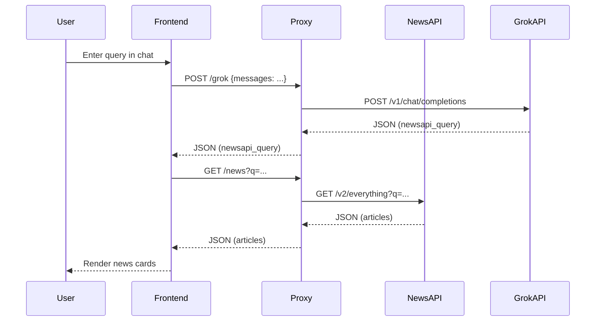

# News Aggregator

A modern news dashboard with a Node.js/Express proxy, local Tailwind CSS, and Docker support. Works natively on Apple Silicon (M1/M2/M3) Macs.

---

## Features
- NewsAPI proxy to keep your API key secure
- Grok (xAI) proxy endpoint for LLM-powered features
- Frontend with local Tailwind CSS (no CDN)
- Dockerized for easy local development
- Chat-driven news filtering
- Debug info for API requests and responses

---

## Prerequisites
- [Docker Desktop](https://www.docker.com/products/docker-desktop/) (Apple Silicon/M3 compatible)
- [Node.js 18+](https://nodejs.org/) (for local dev, optional)
- NewsAPI and xAI (Grok) API keys

---

## Getting Started

### 1. Clone the repository
```zsh
git clone <your-repo-url>
cd news-aggregator
```

### 2. Set up environment variables
Create a `.env` file in the `proxy/` folder with your API keys:
```
NEWS_API_KEY=your_newsapi_key
XAI_API_KEY=your_xai_grok_key
```

### 3. Build and run with Docker
```zsh
docker compose up -d --build
```
- Frontend: http://localhost:8080
- Proxy API: http://localhost:3000

### 4. Local development (optional)
You can run the proxy or frontend locally with Node.js:
```zsh
cd proxy && npm install && npm start
cd frontend && npm install && npm run dev
```

---

## Project Structure
```
proxy/         # Node.js Express API proxy
frontend/      # Static frontend (HTML/JS/CSS)
docker-compose.yml
README.md
```

---

## Endpoints
- `/news` — NewsAPI proxy (uses /v2/everything)
- `/grok` — Grok (xAI) proxy

---

## Customization
- Edit `frontend/index.html` and `frontend/app.js` for UI changes
- Tailwind CSS is built locally (see `frontend/tailwind.config.js`)
- Proxy logic in `proxy/server.js`

---

## Troubleshooting
- If you see npm or Docker errors, try removing `node_modules` and rebuilding:
  ```zsh
  rm -rf proxy/node_modules proxy/package-lock.json frontend/node_modules frontend/package-lock.json
  docker compose down -v
  docker compose up --build
  ```
- For Apple Silicon/M3, images are ARM64-native by default.
- Use `docker compose logs -f` to view logs.

---

# Architecture

## Application Architecture
```mermaid
flowchart TD
  subgraph Frontend
    A[User] -->|UI/Chat| B[HTML/JS (app.js)]
  end
  B -- fetch /news, /grok --> C[Proxy API]
  subgraph Proxy
    C -- NewsAPI request --> D[NewsAPI /v2/everything]
    C -- Grok request --> E[xAI Grok API]
  end
  D -.->|JSON| B
  E -.->|JSON| B
```

## Infrastructure Architecture
```mermaid
graph TD
  subgraph Docker Compose
    FE[frontend container] -- http://localhost:8080 --> User
    PR[proxy container] -- http://localhost:3000 --> FE
    PR -- Internet --> NewsAPI
    PR -- Internet --> xAI Grok
  end
```

## Proxy Component Architecture
```mermaid
flowchart TD
  subgraph Proxy Service
    S1[Express.js Server]
    S2[.env Config]
    S3[NewsAPI Handler (/news)]
    S4[Grok Handler (/grok)]
    S5[Axios HTTP Client]
    S1 --> S2
    S1 --> S3
    S1 --> S4
    S3 --> S5
    S4 --> S5
  end
```

## Proxy Sequence Diagram


---

# Admin/Key Management (Future)
- Admin interface for secure API key management and rotation (see `architecture_notes.txt`)
- Manual key rotation workflow for now; integrated rotation in the future

---

MIT License
