# News Aggregator

A modern news dashboard featuring AI-powered content aggregation, interactive data visualization, and real-time filtering capabilities.

## Overview

The News Aggregator is a sophisticated web application that combines advanced news filtering with AI-driven content analysis. Built with modern web technologies and containerized for consistent development and deployment.

## Core Features

- **AI-Enhanced Search**: Intelligent news filtering and analysis through Grok integration
- **Dynamic Content Cards**: Unified presentation of related news articles
- **Advanced Data Visualization**: Interactive tables with sorting, filtering, and custom views
- **Secure API Layer**: Proxied access to NewsAPI and xAI services
- **Modern UI/UX**: Responsive design with dark mode support

---

## Tech Stack
- **Frontend**: Vanilla JavaScript, HTML5, Tailwind CSS, Tabulator
- **Backend**: Node.js, Express.js, Axios
- **Testing**: Playwright
- **Infrastructure**: Docker Compose, ARM64/Apple Silicon optimized
- **APIs**: NewsAPI, xAI (Grok)

## Architecture Overview
The application follows a modular architecture pattern:

```
┌─────────────────────────────┐      ┌───────────────────────┐
│       Frontend              │      │       Backend         │
│  ┌─────────┐  ┌─────────┐   │      │                       │
│  │  app.js │─▶│ state.js│   │      │                       │
│  └─────┬───┘  └────┬────┘   │      │                       │
│        │           │        │      │                       │
│  ┌─────▼───┐  ┌────▼────┐   │      │  ┌────────────────┐   │
│  │  ui.js  │◀─▶│ api.js  │───┼─────┼─▶│    server.js   │   │
│  └─────┬───┘  └───┬─────┘   │      │  └───────┬────────┘   │
│        │          │         │      │          │            │
│  ┌─────▼──────────▼────┐    │      │  ┌───────▼────────┐   │
│  │     utils.js        │    │      │  │  News & Grok   │   │
│  └────────────────────┘    │      │  │     APIs        │   │
└─────────────────────────────┘      └───────────────────────┘
```

- **app.js**: Application initialization and event handling
- **state.js**: Centralized state management with observer pattern
- **ui.js**: UI rendering and DOM manipulation
- **api.js**: API communication with caching
- **utils.js**: Shared utilities
- **server.js**: Backend proxy with caching and optimizations

---

## Prerequisites
- [Docker Desktop](https://www.docker.com/products/docker-desktop/) (Apple Silicon/M1/M2/M3 compatible)
- [Node.js 18+](https://nodejs.org/) (for local development, optional)
- NewsAPI API key from [newsapi.org](https://newsapi.org/)
- xAI API key from [x.ai](https://x.ai/) for Grok integration

---

## Quick Start

### 1. Clone and Navigate
```zsh
git clone <your-repo-url>
cd news-aggregator
```

### 2. Set up API Keys
Create a `.env` file in the `proxy/` folder:
```env
NEWS_API_KEY=your_newsapi_key_here
XAI_API_KEY=your_xai_grok_key_here
```

### 3. One-Command Setup & Run
```zsh
cd proxy && ./rebuild_stack.sh
```

**That's it!** The rebuild script will:
- Install all dependencies (npm packages, Playwright browsers)
- Build Tailwind CSS
- Start Docker containers
- Run health checks
- Display access URLs

### 4. Access Your Application
- **Frontend**: http://localhost:8080
- **Proxy API**: http://localhost:3000
- **Health Check**: http://localhost:3000/health

---

## Project Structure
```
news-aggregator/
├── docker-compose.yml          # Container orchestration
├── README.md                   # You are here
├── ARCHITECTURE.md             # Application architecture documentation
├── BUGLOG.md                   # Known issues and reproduction steps
├── TODO.md                     # Planned improvements and tasks
├── architecture_notes.txt      # Technical decisions & changelog
├── proxy/                      # Backend API server
│   ├── server.js              # Express.js application with caching and pagination
│   ├── package.json           # Node.js dependencies
│   ├── .env                   # API keys (you create this)
│   ├── Dockerfile             # Container definition
│   └── rebuild_stack.sh       # Development automation script
└── frontend/                   # Frontend application
    ├── index.html             # Main HTML page
    ├── app.js                 # Application initialization and main logic
    ├── state.js               # Centralized state management
    ├── api.js                 # API communication and caching
    ├── ui.js                  # User interface rendering
    ├── utils.js               # Utility functions
    ├── tailwind.css           # Compiled Tailwind styles
    ├── input.css              # Tailwind source
    ├── package.json           # npm dependencies (Tabulator, Playwright)
    ├── src/                   # React component source
    │   ├── App.jsx           # Main React application
    │   ├── components/       # UI components including ChatSidebar.jsx
    │   ├── styles/           # Component-specific styles
    │   └── utils/            # Helper functions
    └── node_modules/          # Local Tabulator installation
```

---

## API Endpoints
- **GET** `/health` — Service health check
- **GET** `/news?q=search_term` — NewsAPI proxy (secure API key handling)
- **POST** `/grok` — xAI Grok proxy for AI-powered chat

---

## Key Features Explained

### 🤖 AI-Powered News Discovery
- Ask Grok questions in natural language
- AI generates optimized search queries
- Results displayed in interactive data grid

### 📊 Advanced Data Visualization
- **Tabulator**: Professional data grid component
- **Sorting**: Click column headers to sort news articles
- **Filtering**: Built-in column filters for all data
- **Pagination**: Handle large result sets efficiently
- **Responsive**: Works on desktop and mobile

### 🔒 Security & Best Practices
- API keys stored server-side only
- CORS configured for local development
- Environment variable configuration
- No sensitive data in frontend code

---

## Development Workflow

### 🚀 The Rebuild Script (Recommended)
The `rebuild_stack.sh` script provides a complete development reset:

```zsh
cd proxy && ./rebuild_stack.sh
```

**What it does:**
1. Stops and removes all containers
2. Cleans npm dependencies 
3. Reinstalls all packages fresh
4. Installs Playwright browsers
5. Builds Tailwind CSS
6. Rebuilds and starts Docker containers
7. Runs health checks
8. Shows you access URLs

### 🔄 Manual Development Commands
```zsh
# Start/restart services
docker compose up -d --build

# View logs
docker compose logs -f

# Stop services
docker compose down

# Run tests
cd frontend && npm test

# Build Tailwind CSS manually
cd frontend && npx tailwindcss -i input.css -o tailwind.css

# Restart specific service
docker compose restart frontend
```

### 🧪 Testing
```zsh
cd frontend

# Run all tests
npm test

# Run tests in headed mode (see browser)
npm run test:headed

# Debug tests
npm run test:debug
```

---

## Troubleshooting

### Common Issues & Solutions

#### ❌ Card Creation Issues
**In progress!** Sometimes new cards are not created for certain queries.
- Check console for `[ChatSidebar]` debug messages
- Verify the API returned valid articles
- Try a different search query
- See `BUGLOG.md` for more details

#### ❌ Pagination Controls Cut Off
**In progress!** The table pagination controls may be cut off in some cards.
- This has been partially fixed by increasing card height to 270px and adding margin
- If you still see this issue, you can add additional margin to the cards

#### ❌ Tabulator Failed to Load
**Fixed in latest version!** We now use local npm installation instead of CDN, with proper Luxon integration.
- If you still see this, run: `./proxy/rebuild_stack.sh`
- For Luxon dependency errors, check browser console for detailed logs

#### ❌ Docker Credential Issues
**Fixed in latest version!** Simplified Docker configuration removes credential dependencies.
- If you encounter this, the rebuild script handles it automatically

#### ❌ Port Already in Use
```zsh
# Check what's using the ports
lsof -ti:3000 -ti:8080

# Kill processes if needed
docker compose down
```

#### ❌ npm/Node Issues
```zsh
# Clean install everything
./proxy/rebuild_stack.sh
```

#### ❌ API Key Issues
- Verify your `.env` file exists in `proxy/` folder
- Check API keys are valid and have proper permissions
- Test health endpoint: `curl http://localhost:3000/health`

#### ❌ Tabulator Date Formatting Issues
**Fixed in latest version!** Date formatting is now handled natively in JavaScript. Luxon is no longer required.
- If you still see date issues, check your browser cache and ensure you are running the latest code.
- See the `formatDateSafe` utility in `frontend/src/utils/dateUtils.js` for details.

### 🐞 Debug Mode
- Debug logging is enabled by default in development
- Toggle debug in the frontend sidebar
- Check browser console for detailed logs with prefixes:
  - `[ChatSidebar]` - Card creation and chat interaction logs
  - `[App]` - Main application state changes
  - `[NewsTable]` - Table rendering and data issues
- View server logs: `docker compose logs proxy`
- Card creation debugging:
  ```javascript
  // Example debug log sequence for card creation
  [ChatSidebar] handleSend: newsResults [...] 
  [ChatSidebar] handleSend: validArticles [...]
  [ChatSidebar] handleSend: newCard {...}
  [ChatSidebar] handleSend: onCreateCard result true|false
  ```

---

## Known Issues (2025-06-11)

- New cards are sometimes not created for certain queries (e.g. 'cats'), or all new searches are added to the same table/card.
- ~~Tabulator dependency issues with Luxon (resolved in latest update)~~
- There is no clear local log of card creation events, making debugging difficult. Debug logging has now been added to `ChatSidebar.jsx`.
- Pagination controls at the bottom of the table can be cut off depending on card/table height (fix is in progress).
- Card creation logic sometimes reports success even when no card was actually created.
- See `BUGLOG.md` for more details and reproduction steps.

## Debugging Tips
- Open the browser console and look for `[ChatSidebar]` logs to trace card creation attempts/results.
- Debug logs are prefixed with tags like `[ChatSidebar]` and contain information about:
  - Card creation attempts
  - News API results
  - Valid article filtering
  - New card creation details
  - Success/failure of card addition
- If a card is not created, check the API response and the debug logs for clues.
- Check `ARCHITECTURE.md` for information about the card creation flow.

---

## Recent Updates & Fixes

### ✅ 2025-06-11 - Native Date Formatting (No Luxon)
- **Removed Luxon dependency for all date formatting in Tabulator.**
- All date columns now use a native JavaScript formatter for reliability.
- See `frontend/src/utils/dateUtils.js` for the new implementation.

### ✅ 2025-06-11 - Tabulator Luxon Integration Fix
**Resolved Tabulator datetime formatting issues:**
- **Fixed Luxon dependency**: Properly exposed Luxon DateTime to Tabulator for date formatting
- **Added custom formatters**: Created robust `luxonDatetime` formatter with fallbacks
- **Enhanced resilience**: Added `formatDateSafe()` utility to handle date formatting issues
- **Synchronized versions**: Updated Tabulator CDN version from 5.5.0 to 6.3.0 to match npm package
- **Added tabulator-init.js**: Created initialization module to ensure proper formatter setup
- **Improved error handling**: Enhanced logging and fallback mechanisms for dates

### ✅ 2025-06-10 - Card Creation & Debugging Improvements
**Card creation and UI fixes:**
- **Enhanced debugging**: Added comprehensive debug logging in `ChatSidebar.jsx` to trace card creation flow
- **Improved feedback accuracy**: Updated card creation to only show success messages when cards are actually created
- **Fixed UI glitches**: Increased card height and margin to prevent pagination controls from being cut off
- **Better documentation**: Added `BUGLOG.md`, `TODO.md`, and `ARCHITECTURE.md` for tracking issues and structure
- **Security improvement**: Changed test credentials from "testpass" to "notasecret" to avoid git secrets warnings
- **CI improvement**: Removed pre-commit hook that was causing secret scanning warnings during commits

### ✅ 2025-06-09 - Tabulator Migration & Cleanup
- **Migrated to Tabulator**: Replaced ag-Grid with Tabulator for news table rendering
- **Removed ag-Grid references**: Cleaned up all ag-Grid code, tests, and documentation
- **Updated Playwright tests**: Now test Tabulator integration

### ✅ 2025-06-08 - ag-Grid Reliability & Docker Credential Fix
**Major stability improvements:**
- **Fixed ag-Grid loading issues**: Switched from unreliable CDN to local npm package
- **Resolved Docker credential problems**: Simplified Docker configuration 
- **Updated ag-Grid API**: Support for both modern (`createGrid`) and legacy (`Grid`) APIs
- **Enhanced error handling**: Better debugging and fallback mechanisms
- **Improved script order**: Fixed race conditions in resource loading
- **All tests passing**: 4/4 Playwright integration tests now pass reliably

---

## Architecture

### Application Architecture

```mermaid
flowchart TD
    User[👤 User] -->|UI Interaction| Frontend[🖥️ Frontend App]
    Frontend -->|API Requests| Proxy[🔧 Proxy Server]
    Proxy -->|News Query| NewsAPI[📰 NewsAPI]
    Proxy -->|AI Chat| Grok[🤖 xAI Grok]
    Frontend -->|Renders| Tabulator[📊 Tabulator]
    
    Frontend -.->|Local Files| CSS[🎨 Tailwind CSS]
    Frontend -.->|Local Package| Tabulator
```


### Infrastructure Architecture  

```mermaid
flowchart TD
    User[👤 User] 
    FE[🖥️ Frontend Container<br/>Port 8080]
    PR[🔧 Proxy Container<br/>Port 3000]
    
    User -->|Browser| FE
    FE -->|HTTP| PR
    PR -->|HTTPS| NewsAPI[📰 NewsAPI.org]
    PR -->|HTTPS| Grok[🤖 xAI API]
    
    FE -.->|Volume Mount| FECode[💻 ./frontend/]
    PR -.->|Volume Mount| PRCode[💻 ./proxy/]
    PR -.->|Environment| ENV[🔐 .env file]
```


### Request Flow


---

# Admin/Key Management (Future)
- Admin interface for secure API key management and rotation (see `architecture_notes.txt`)
- Manual key rotation workflow for now; integrated rotation in the future

---

## Revision History

### 2025-06-08
- **Intent:** Fix NewsAPI 500 error on default load when no query is provided.
- **Summary:**
  - Updated proxy/server.js to fallback to /v2/top-headlines with country=us if no query is provided, preventing 500 errors.
  - Ensured only NewsAPI-supported params are sent to the API.
- **Files Changed:**
  - proxy/server.js

### 2025-06-08
- **Intent:** Improve ag-Grid reliability, error handling, and developer workflow.
- **Summary:**
  - Switched all ag-Grid CSS/JS to CDN links only; removed local node_modules references.
  - Moved ag-Grid CDN script to end of <body> in index.html to guarantee load order.
  - Added waitForAgGrid in app.js to delay app initialization until ag-Grid is available, with clear error if not.
  - Improved Grok response parsing and debug logging in app.js.
  - Added pro forma Playwright/Puppeteer-style UI test (agGridLoad.test.js) for ag-Grid and chat/news card flow.
  - Updated documentation and troubleshooting guidance in README.
- **Files Changed:**
  - frontend/index.html
  - frontend/app.js
  - frontend/agGridLoad.test.js
  - README.md

### 2025-06-09
- **Intent:** Migrate to Tabulator and clean up ag-Grid references.
- **Summary:**
  - Replaced ag-Grid with Tabulator in frontend code and dependencies.
  - Updated Playwright tests to verify Tabulator integration.
  - Removed all ag-Grid related files, dependencies, and documentation.
- **Files Changed:**
  - frontend/index.html
  - frontend/app.js
  - frontend/package.json
  - frontend/tabulator.test.js
  - README.md

### 2025-06-11
- **Intent:** Resolve date formatting issues and remove Luxon dependency.
- **Summary:**
  - All date formatting is now handled natively in JavaScript in Tabulator.
  - Removed Luxon-related code and dependencies.
  - Added `formatDateSafe` utility in `frontend/src/utils/dateUtils.js` for safe date formatting.
  - Updated documentation to reflect native date handling.
- **Files Changed:**
  - frontend/src/utils/dateUtils.js
  - frontend/app.js
  - README.md

**Note:** You may see a git warning about a potential secret in `proxy/server.js`. This is a demo value ("notasecret") and not a real credential. It is safe for development purposes.

---

## Card Creation Process

The application creates news cards through the following flow:

1. User makes a query in the chat interface (`ChatSidebar.jsx`)
2. Request is sent to Grok via the proxy server
3. Response is processed to extract news articles
4. Valid articles are filtered and formatted
5. A card object is created with a unique ID and the formatted articles
6. `onCreateCard()` is called to add the card to the application state
7. Feedback is provided based on the success/failure of card creation

### Debugging Card Creation Issues

If you encounter issues with card creation:

1. Check console logs for messages prefixed with `[ChatSidebar]`
2. Verify that `handleCreateCard` in `App.jsx` is properly detecting duplicates
3. Ensure card height and margins are sufficient for pagination controls
4. Review `BUGLOG.md` for known issues and reproduction steps
5. Check `TODO.md` for planned improvements

### ⚡ 2025-06-11 - Date Formatting Now Native (No Luxon Required)
- **No more Luxon dependency for date formatting in Tabulator!**
- All date formatting is now handled natively in JavaScript for maximum reliability.
- If you see any date formatting issues, check the new `formatDateSafe` utility in `frontend/src/utils/dateUtils.js`.
- The code and documentation have been updated to reflect this change.

#### Troubleshooting Tabulator Date Columns
- If dates do not display, ensure you are using the latest code and have cleared your browser cache.
- The formatter for date columns is now a simple inline function or uses `formatDateSafe`.
- No external date libraries are required for correct display.
