# News Aggregator

A modern news dashboard with ag-Grid data visualization, Node.js/Express proxy, Tailwind CSS, and Docker support. Features AI-powered chat interface with Grok for intelligent news filtering and analysis.

---

## Features
- **🔒 Secure API Proxy**: NewsAPI and xAI (Grok) proxy to keep your API keys secure
- **🤖 AI-Powered Chat**: Grok integration for intelligent news filtering and analysis
- **📊 Advanced Data Grid**: ag-Grid community edition for sortable, filterable news display
- **🎨 Modern UI**: Tailwind CSS with responsive design
- **🐳 Dockerized**: Complete containerized development environment
- **⚡ Hot Reload**: Docker Compose develop mode for instant code changes
- **🧪 Automated Testing**: Playwright integration tests for reliability
- **🛠️ Developer Tools**: One-click rebuild script and debugging features

---

## Tech Stack
- **Frontend**: Vanilla JavaScript, HTML5, Tailwind CSS, ag-Grid Community
- **Backend**: Node.js, Express.js, Axios
- **Testing**: Playwright
- **Infrastructure**: Docker Compose, ARM64/Apple Silicon optimized
- **APIs**: NewsAPI, xAI (Grok)

---

## Prerequisites
- [Docker Desktop](https://www.docker.com/products/docker-desktop/) (Apple Silicon/M1/M2/M3 compatible)
- [Node.js 18+](https://nodejs.org/) (for local development, optional)
- NewsAPI API key from [newsapi.org](https://newsapi.org/)
- xAI API key from [x.ai](https://x.ai/) for Grok integration

---

## Quick Start

### 1. Clone and Navigate
```zsh
git clone <your-repo-url>
cd news-aggregator
```

### 2. Set up API Keys
Create a `.env` file in the `proxy/` folder:
```env
NEWS_API_KEY=your_newsapi_key_here
XAI_API_KEY=your_xai_grok_key_here
```

### 3. One-Command Setup & Run
```zsh
cd proxy && ./rebuild_stack.sh
```

**That's it!** The rebuild script will:
- Install all dependencies (npm packages, Playwright browsers)
- Build Tailwind CSS
- Start Docker containers
- Run health checks
- Display access URLs

### 4. Access Your Application
- **Frontend**: http://localhost:8080
- **Proxy API**: http://localhost:3000
- **Health Check**: http://localhost:3000/health

---

## Project Structure
```
news-aggregator/
├── docker-compose.yml          # Container orchestration
├── README.md                   # You are here
├── architecture_notes.txt      # Technical decisions & changelog
├── proxy/                      # Backend API server
│   ├── server.js              # Express.js application
│   ├── package.json           # Node.js dependencies
│   ├── .env                   # API keys (you create this)
│   ├── Dockerfile             # Container definition
│   └── rebuild_stack.sh       # Development automation script
└── frontend/                   # Frontend application
    ├── index.html             # Main HTML page
    ├── app.js                 # Application logic
    ├── tailwind.css           # Compiled Tailwind styles
    ├── input.css              # Tailwind source
    ├── package.json           # npm dependencies (ag-Grid, Playwright)
    ├── agGridLoad.test.js     # Integration tests
    ├── playwright.config.js   # Test configuration
    └── node_modules/          # Local ag-Grid installation
```

---

## API Endpoints
- **GET** `/health` — Service health check
- **GET** `/news?q=search_term` — NewsAPI proxy (secure API key handling)
- **POST** `/grok` — xAI Grok proxy for AI-powered chat

---

## Key Features Explained

### 🤖 AI-Powered News Discovery
- Ask Grok questions in natural language
- AI generates optimized search queries
- Results displayed in interactive data grid

### 📊 Advanced Data Visualization
- **ag-Grid Community**: Professional data grid component
- **Sorting**: Click column headers to sort news articles
- **Filtering**: Built-in column filters for all data
- **Pagination**: Handle large result sets efficiently
- **Responsive**: Works on desktop and mobile

### 🔒 Security & Best Practices
- API keys stored server-side only
- CORS configured for local development
- Environment variable configuration
- No sensitive data in frontend code

---

## Development Workflow

### 🚀 The Rebuild Script (Recommended)
The `rebuild_stack.sh` script provides a complete development reset:

```zsh
cd proxy && ./rebuild_stack.sh
```

**What it does:**
1. Stops and removes all containers
2. Cleans npm dependencies 
3. Reinstalls all packages fresh
4. Installs Playwright browsers
5. Builds Tailwind CSS
6. Rebuilds and starts Docker containers
7. Runs health checks
8. Shows you access URLs

### 🔄 Manual Development Commands
```zsh
# Start/restart services
docker compose up -d --build

# View logs
docker compose logs -f

# Stop services
docker compose down

# Run tests
cd frontend && npm test

# Build Tailwind CSS manually
cd frontend && npx tailwindcss -i input.css -o tailwind.css

# Restart specific service
docker compose restart frontend
```

### 🧪 Testing
```zsh
cd frontend

# Run all tests
npm test

# Run tests in headed mode (see browser)
npm run test:headed

# Debug tests
npm run test:debug
```

---

## Troubleshooting

### Common Issues & Solutions

#### ❌ ag-Grid Failed to Load
**Fixed in latest version!** We now use local npm installation instead of CDN.
- If you still see this, run: `./proxy/rebuild_stack.sh`

#### ❌ Docker Credential Issues
**Fixed in latest version!** Simplified Docker configuration removes credential dependencies.
- If you encounter this, the rebuild script handles it automatically

#### ❌ Port Already in Use
```zsh
# Check what's using the ports
lsof -ti:3000 -ti:8080

# Kill processes if needed
docker compose down
```

#### ❌ npm/Node Issues
```zsh
# Clean install everything
./proxy/rebuild_stack.sh
```

#### ❌ API Key Issues
- Verify your `.env` file exists in `proxy/` folder
- Check API keys are valid and have proper permissions
- Test health endpoint: `curl http://localhost:3000/health`

### 🐞 Debug Mode
- Debug logging is enabled by default in development
- Toggle debug in the frontend sidebar
- Check browser console for detailed logs
- View server logs: `docker compose logs proxy`

---

## Recent Updates & Fixes

### ✅ 2025-06-08 - ag-Grid Reliability & Docker Credential Fix
**Major stability improvements:**
- **Fixed ag-Grid loading issues**: Switched from unreliable CDN to local npm package
- **Resolved Docker credential problems**: Simplified Docker configuration 
- **Updated ag-Grid API**: Support for both modern (`createGrid`) and legacy (`Grid`) APIs
- **Enhanced error handling**: Better debugging and fallback mechanisms
- **Improved script order**: Fixed race conditions in resource loading
- **All tests passing**: 4/4 Playwright integration tests now pass reliably

### ✅ 2025-06-08 - Enhanced Testing & Debugging
- **Playwright integration**: Comprehensive browser-based testing
- **Debug controls**: Frontend sidebar toggle for detailed logging
- **Health monitoring**: Automatic service health checks in rebuild script
- **Error boundaries**: Graceful handling of API and rendering errors

---

## Architecture

### Application Architecture

```mermaid
flowchart TD
    User[👤 User] -->|UI Interaction| Frontend[🖥️ Frontend App]
    Frontend -->|API Requests| Proxy[🔧 Proxy Server]
    Proxy -->|News Query| NewsAPI[📰 NewsAPI]
    Proxy -->|AI Chat| Grok[🤖 xAI Grok]
    Frontend -->|Renders| AgGrid[📊 ag-Grid]
    
    Frontend -.->|Local Files| CSS[🎨 Tailwind CSS]
    Frontend -.->|Local Package| AgGrid
```


### Infrastructure Architecture  

```mermaid
flowchart TD
    User[👤 User] 
    FE[🖥️ Frontend Container<br/>Port 8080]
    PR[🔧 Proxy Container<br/>Port 3000]
    
    User -->|Browser| FE
    FE -->|HTTP| PR
    PR -->|HTTPS| NewsAPI[📰 NewsAPI.org]
    PR -->|HTTPS| Grok[🤖 xAI API]
    
    FE -.->|Volume Mount| FECode[💻 ./frontend/]
    PR -.->|Volume Mount| PRCode[💻 ./proxy/]
    PR -.->|Environment| ENV[🔐 .env file]
```


### Request Flow


---

# Admin/Key Management (Future)
- Admin interface for secure API key management and rotation (see `architecture_notes.txt`)
- Manual key rotation workflow for now; integrated rotation in the future

---

## Revision History

### 2025-06-08
- **Intent:** Fix NewsAPI 500 error on default load when no query is provided.
- **Summary:**
  - Updated proxy/server.js to fallback to /v2/top-headlines with country=us if no query is provided, preventing 500 errors.
  - Ensured only NewsAPI-supported params are sent to the API.
- **Files Changed:**
  - proxy/server.js

### 2025-06-08
- **Intent:** Improve ag-Grid reliability, error handling, and developer workflow.
- **Summary:**
  - Switched all ag-Grid CSS/JS to CDN links only; removed local node_modules references.
  - Moved ag-Grid CDN script to end of <body> in index.html to guarantee load order.
  - Added waitForAgGrid in app.js to delay app initialization until ag-Grid is available, with clear error if not.
  - Improved Grok response parsing and debug logging in app.js.
  - Added pro forma Playwright/Puppeteer-style UI test (agGridLoad.test.js) for ag-Grid and chat/news card flow.
  - Updated documentation and troubleshooting guidance in README.
- **Files Changed:**
  - frontend/index.html
  - frontend/app.js
  - frontend/agGridLoad.test.js
  - README.md
