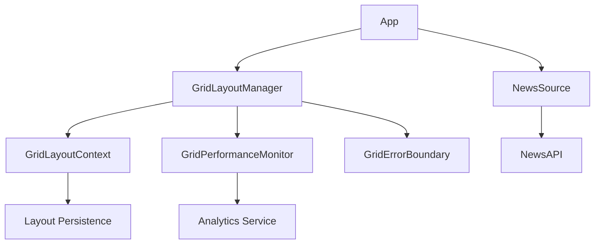
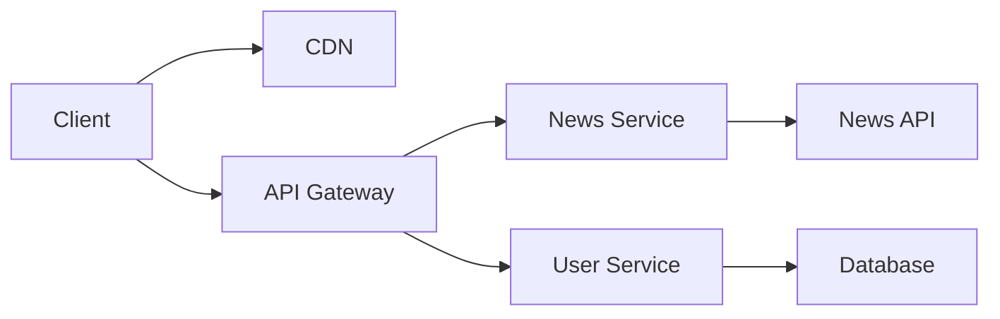

# News Aggregator Architecture

## System Overview

The News Aggregator is built with a modern, component-based architecture focusing on performance, maintainability, and user experience.

## Key Components



### Core Components

1. **GridLayoutManager**
   - Manages grid layout and interactions
   - Handles drag and drop functionality
   - Integrates with performance monitoring
   - Manages error boundaries

2. **GridLayoutContext**
   - Provides centralized state management
   - Handles layout persistence
   - Manages user preferences

3. **GridPerformanceMonitor**
   - Tracks performance metrics
   - Monitors resource usage
   - Generates performance reports

4. **Natural Language Processing**
   - Processes user commands
   - Maps commands to actions
   - Provides command suggestions

## Data Flow

1. **User Interactions**
   ```mermaid
   sequenceDiagram
       User->>GridLayoutManager: Interact with grid
       GridLayoutManager->>GridPerformanceMonitor: Track interaction
       GridLayoutManager->>GridLayoutContext: Update layout
       GridLayoutContext->>Storage: Persist changes
   ```

2. **Error Handling**
   ```mermaid
   sequenceDiagram
       Component->>GridErrorBoundary: Throw error
       GridErrorBoundary->>Logger: Log error
       GridErrorBoundary->>UI: Show error UI
       GridErrorBoundary->>Analytics: Track error
   ```

## Performance Considerations

1. **Layout Performance**
   - Virtual scrolling for large lists
   - Debounced layout updates
   - Optimized DOM operations

2. **Memory Management**
   - Proper cleanup of resources
   - Efficient event handling
   - Smart caching strategies

## Security

1. **Input Validation**
   - Sanitize user commands
   - Validate layout changes
   - Prevent XSS attacks

2. **Data Protection**
   - Secure storage of user preferences
   - Protected API endpoints
   - Safe error handling

## Deployment Architecture



## Technology Stack

- **Frontend**
  - React
  - CSS Grid/Flexbox
  - Performance monitoring tools
  - Error boundary components

- **Backend**
  - Node.js
  - Express
  - MongoDB
  - Redis for caching

## Future Considerations

1. **Scalability**
   - Implement microservices
   - Add load balancing
   - Optimize caching

2. **Features**
   - Enhanced NLP capabilities
   - More layout options
   - Advanced analytics

3. **Performance**
   - Progressive loading
   - Service workers
   - Advanced caching
