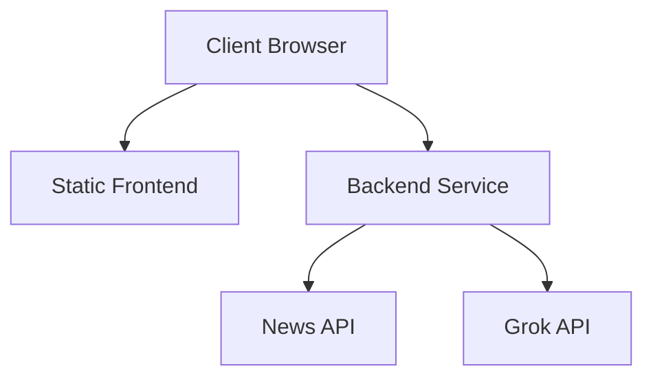

# Production Deployment Guide

## Deployment Options

### 1. Render Platform

The application is configured for deployment on Render using the provided `render.yaml` configuration.

#### Setup Steps

1. **Fork Repository**
   ```bash
   git clone https://github.com/yourusername/news-aggregator.git
   cd news-aggregator
   ```

2. **Connect to Render**
   - Visit [dashboard.render.com](https://dashboard.render.com)
   - Click "New +" and select "Blueprint"
   - Connect your repository
   - Select the main branch

3. **Configure Environment**
   Set the following environment variables in Render:
   - `NEWS_API_KEY`
   - `XAI_API_KEY`
   - `NODE_ENV=production`
   - `PORT=3000`

4. **Deploy**
   - Render will automatically deploy both frontend and backend
   - Monitor the deployment logs
   - Verify health checks

#### Service Architecture



### 2. Manual Production Setup

#### Frontend Deployment

1. **Build Frontend**
   ```bash
   cd frontend
   npm install
   npm run build
   ```

2. **Serve Static Files**
   - Deploy `dist/` to your static hosting service
   - Configure CORS and security headers
   - Enable HTTPS

#### Backend Deployment

1. **Prepare Backend**
   ```bash
   cd proxy
   npm install
   ```

2. **Configure Environment**
   ```bash
   # Create production environment file
   cat > .env.production << EOL
   NEWS_API_KEY=your_key_here
   XAI_API_KEY=your_key_here
   NODE_ENV=production
   PORT=3000
   EOL
   ```

3. **Start Server**
   ```bash
   NODE_ENV=production node server.js
   ```

### 3. Docker Production Setup

1. **Build Images**
   ```bash
   docker compose -f docker-compose.prod.yml build
   ```

2. **Deploy Stack**
   ```bash
   docker compose -f docker-compose.prod.yml up -d
   ```

3. **Monitor Services**
   ```bash
   docker compose -f docker-compose.prod.yml logs -f
   ```

## Production Considerations

### Security

1. **API Security**
   - Enable rate limiting
   - Implement request validation
   - Configure CORS properly
   - Use secure headers

2. **Infrastructure Security**
   - Enable HTTPS
   - Configure firewalls
   - Regular security updates
   - Monitor access logs

### Performance

1. **Frontend Optimization**
   - Enable CDN caching
   - Optimize asset delivery
   - Implement lazy loading
   - Monitor client-side errors

2. **Backend Optimization**
   - Configure caching
   - Optimize database queries
   - Monitor API response times
   - Set up load balancing

### Monitoring

1. **Health Checks**
   ```bash
   # Check API health
   curl https://your-api.com/health
   
   # Check metrics
   curl https://your-api.com/metrics
   ```

2. **Logging**
   - Configure application logging
   - Set up error tracking
   - Monitor system resources
   - Track API usage

### Backup and Recovery

1. **Data Backup**
   - Schedule regular backups
   - Test restoration process
   - Document recovery steps

2. **Failover Strategy**
   - Configure high availability
   - Implement automatic failover
   - Test disaster recovery

## Troubleshooting

### Common Issues

1. **Build Failures**
   - Check build logs
   - Verify dependencies
   - Update Node.js version

2. **API Issues**
   - Verify API keys
   - Check rate limits
   - Monitor error logs

3. **Performance Problems**
   - Check resource usage
   - Monitor response times
   - Optimize queries

### Support Resources

- Documentation: `/docs`
- Issue Tracker: GitHub Issues
- Status Page: status.news-aggregator.com
- Support Email: support@news-aggregator.com
